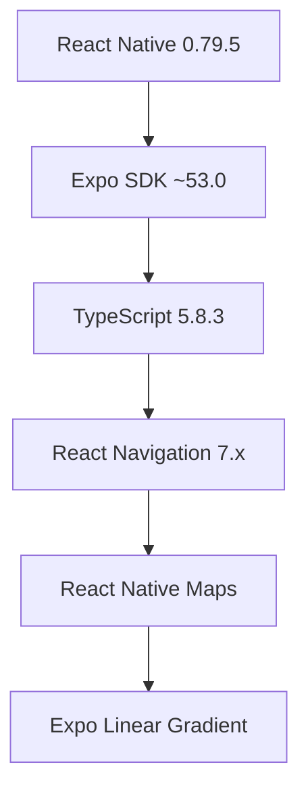

# 🍽️ 內湖美食搜尋 App

<div align="center">


**專業級 React Native + Expo 美食探索應用**

*針對台北內湖區打造的智慧美食發現平台*

[](https://reactnative.dev/)
[](https://expo.dev/)
[](https://www.typescriptlang.org/)
[]()

</div>

---

## 📋 目錄

- [🎯 專案概述](#-專案概述)
- [✨ 核心功能](#-核心功能)
- [🏗️ 技術架構](#️-技術架構)
- [🚀 快速開始](#-快速開始)
- [📱 使用指南](#-使用指南)
- [🛠️ 開發指南](#️-開發指南)
- [📁 專案結構](#-專案結構)
- [🎨 設計系統](#-設計系統)
- [📊 資料管理](#-資料管理)
- [🔧 進階配置](#-進階配置)

---

## 🎯 專案概述

**內湖美食搜尋 App** 是一款專為台北內湖區設計的智慧美食發現應用，結合現代化的移動端 UI/UX 設計與強大的搜尋功能，為用戶提供最佳的美食探索體驗。

### 🌟 專案亮點

- **🏆 專業級架構** - 採用 React Native + Expo 打造跨平台原生體驗
- **🧠 智慧搜尋** - 多維度篩選系統，精準符合用戶需求
- **�️ 地圖整合** - 整合 Google Maps，提供直觀的地理位置服務
- **♿ 無障礙設計** - 符合 WCAG 2.1 標準，支援輔助功能
- **🌙 主題支援** - 自適應亮色/暗色主題切換
- **📱 響應式** - 完美適配各種螢幕尺寸和解析度

---

## ✨ 核心功能

### 🔍 智慧搜尋系統
- **關鍵字搜尋** - 支援餐廳名稱、料理類型、食材搜尋
- **多維度篩選** - 料理類型、價位區間、營業狀態、評分等級
- **過敏原管理** - 完整的過敏原標示與篩選功能
- **素食友善** - 素食、蛋奶素等飲食偏好篩選

### 📍 互動式地圖
- **即時定位** - GPS 定位與距離計算
- **視覺化標記** - 不同料理類型的專屬圖標
- **選擇介面** - 點擊標記顯示餐廳詳細資訊
- **導航整合** - 一鍵開啟 Google Maps 導航

### 🍽️ 餐廳資訊管理
- **完整資料** - 營業時間、聯絡資訊、菜單價格
- **用戶評價** - 評分系統與評論展示
- **照片展示** - 高品質餐廳與料理照片
- **即時狀態** - 營業中/已打烊狀態顯示

### 👤 個人化體驗
- **偏好設定** - 料理類型偏好與黑名單管理
- **過敏警示** - 個人過敏原設定與提醒
- **搜尋歷史** - 智慧記憶用戶搜尋習慣
- **收藏功能** - 我的最愛餐廳收藏系統

### � 料理類型覆蓋

<table>
<tr>
<td>

**🍣 日式料理**
- 壽司 / 生魚片
- 拉麵 / 烏龍麵
- 丼飯 / 定食
- 居酒屋料理

</td>
<td>

**🥟 中式料理**
- 熱炒 / 快炒
- 小籠包 / 餃子
- 牛肉麵 / 麵食
- 港式飲茶

</td>
</tr>
<tr>
<td>

**🍔 美式料理**
- 漢堡 / 薯條
- 牛排 / 烤肉
- 炸雞 / 雞翅
- 墨西哥料理

</td>
<td>

**🥐 法式料理**
- 可頌 / 麵包
- 法式甜點
- 咖啡文化
- 精緻料理

</td>
</tr>
<tr>
<td>

**🍰 甜點咖啡**
- 手工蛋糕
- 特調咖啡
- 下午茶點
- 冰品飲料

</td>
<td>

**🥗 健康輕食**
- 新鮮沙拉
- 健身餐盒
- 蔬食料理
- 養生湯品

</td>
</tr>
<tr>
<td colspan="2">

**🥞 早午餐**
- 班尼迪克蛋
- 鬆餅 / 法式吐司
- 酪梨吐司
- 全天候早餐

</td>
</tr>
</table>

### 💰 價位區間系統

| 區間 | 價格範圍 | 適合場合 | 代表性餐廳 |
|------|----------|----------|------------|
| 💸 **經濟實惠** | NT$ 0-250 | 日常用餐、學生族群 | 小吃攤、連鎖快餐 |
| 💵 **中等價位** | NT$ 250-500 | 朋友聚餐、家庭聚會 | 一般餐廳、咖啡廳 |
| 💴 **中高檔次** | NT$ 500-1000 | 約會聚餐、商務用餐 | 精緻餐廳、特色料理 |
| 💎 **頂級享受** | NT$ 1000+ | 特殊慶祝、高級體驗 | 米其林餐廳、星級飯店 |

---

## 🏗️ 技術架構

### 核心技術棧



| 技術 | 版本 | 用途 | 優勢 |
|------|------|------|------|
| **React Native** | 0.79.5 | 跨平台框架 | 原生效能、程式碼復用 |
| **Expo SDK** | ~53.0.20 | 開發平台 | 快速迭代、豐富 API |
| **TypeScript** | ~5.8.3 | 靜態型別 | 程式碼品質、開發效率 |
| **React Navigation** | 7.x | 路由導航 | 原生導航體驗 |
| **React Native Maps** | 1.20.1 | 地圖功能 | Google Maps 整合 |
| **Expo Vector Icons** | 14.1.0 | 圖標系統 | 豐富的圖標資源 |

### 架構設計模式

- **🏛️ 組件化架構** - 模組化開發，提高程式碼復用性
- **� 響應式設計** - 適配各種螢幕尺寸和裝置類型
- **⚡ 效能優化** - lazy loading、記憶體管理、渲染最佳化
- **🔒 型別安全** - 完整的 TypeScript 型別定義
- **🎯 單一責任** - 每個組件職責明確，易於維護

---

## �🚀 快速開始

### 環境要求

| 工具 | 最低版本 | 建議版本 | 說明 |
|------|----------|----------|------|
| **Node.js** | 18.x | 20.x LTS | JavaScript 執行環境 |
| **npm/yarn** | 8.x | 最新版 | 套件管理工具 |
| **Expo CLI** | 最新版 | 最新版 | Expo 開發工具 |
| **Git** | 2.x | 最新版 | 版本控制系統 |

### 🔧 安裝步驟

#### 1. **複製專案**
```bash
git clone https://github.com/your-username/cuisine_searching-github.git
cd cuisine_searching-github
```

#### 2. **安裝依賴**
```bash
# 使用 npm
npm install

# 或使用 yarn
yarn install
```

#### 3. **啟動開發服務器**
```bash
# 啟動 Expo 開發服務器
npm start
# 或
npx expo start --clear
```

#### 4. **在裝置上預覽**

##### 📱 **行動裝置預覽**
1. **下載 Expo Go App**
   - 🍎 [iOS App Store](https://apps.apple.com/app/expo-go/id982107779)
   - 🤖 [Android Play Store](https://play.google.com/store/apps/details?id=host.exp.exponent)

2. **掃描 QR 碼**
   - **iOS**: 使用相機 App 掃描終端中的 QR 碼
   - **Android**: 在 Expo Go App 中掃描 QR 碼

##### 💻 **模擬器運行**
```bash
# iOS 模擬器 (macOS only)
npm run ios

# Android 模擬器
npm run android

# Web 瀏覽器
npm run web
```

### ⚡ 一鍵啟動 (VS Code)

如果您使用 VS Code，可以使用內建的任務系統：

1. 按 `Ctrl + Shift + P` (Windows) 或 `Cmd + Shift + P` (macOS)
2. 輸入 "Tasks: Run Task"
3. 選擇 "Start Expo Development Server"

---

## 📱 使用指南

### 🏠 首頁 - 智慧選擇流程

<div align="center">

| 步驟 1: 選擇料理 | 步驟 2: 設定預算 | 步驟 3: 檢視結果 |
|:---------------:|:---------------:|:---------------:|
|  |  |  |
| 7 種主要料理類型 | 4 個價位區間 | 個人化推薦清單 |

</div>

#### 功能特色：
- **🎯 引導式選擇** - 逐步引導用戶縮小搜尋範圍
- **📊 進度指示** - 清楚顯示當前步驟與完成進度
- **⚡ 快速入口** - 直接跳轉進階搜尋、地圖等功能
- **📈 統計資訊** - 即時顯示餐廳數量與分類統計

### 🔍 搜尋頁面 - 進階篩選系統

#### 搜尋功能：
- **🔤 關鍵字搜尋** - 餐廳名稱、料理描述、地址搜尋
- **🏷️ 標籤篩選** - 多選式料理類型篩選
- **💰 價格區間** - 彈性的價位範圍選擇
- **🚫 過敏原** - 8 大過敏原標示與篩選
- **🌱 飲食偏好** - 素食、蛋奶素等選項

#### 結果展示：
- **📋 清單檢視** - 詳細的餐廳資訊卡片
- **⭐ 評分系統** - 五星評分與評論數量
- **🕒 營業狀態** - 即時營業中/已打烊狀態
- **🏷️ 特色標籤** - 素食友善、高評價等標籤

### 🗺️ 地圖頁面 - 地理位置服務

#### 地圖功能：
- **📍 即時定位** - GPS 定位與用戶位置顯示
- **🎯 餐廳標記** - 不同料理類型的專屬圖標
- **👆 互動操作** - 點擊標記顯示餐廳資訊
- **📱 底部面板** - 滑動選擇餐廳清單

#### 導航整合：
- **🧭 一鍵導航** - 直接開啟 Google Maps 導航
- **📞 快速聯繫** - 一鍵撥打餐廳電話
- **📍 地址顯示** - 完整地址與距離計算

### 👤 個人檔案 - 個人化設定

#### 基本資訊：
- **📝 個人資料** - 姓名、email、電話設定
- **📊 用餐習慣** - 喜好料理類型統計
- **⚙️ 應用設定** - 通知、主題、語言設定

#### 飲食管理：
- **❤️ 料理偏好** - 最愛與避免的料理類型
- **🚫 過敏管理** - 個人過敏原設定與警示
- **🌱 素食設定** - 素食類型偏好選擇
- **📏 搜尋範圍** - 自定義搜尋距離範圍

---

## 🛠️ 開發指南

### 📋 開發環境設置

#### VS Code 推薦擴充套件
```json
{
  "recommendations": [
    "ms-vscode.vscode-typescript-next",
    "expo.vscode-expo-tools",
    "bradlc.vscode-tailwindcss",
    "ms-vscode.vscode-json",
    "esbenp.prettier-vscode",
    "ms-vscode.vscode-eslint"
  ]
}
```

#### 程式碼品質工具
- **ESLint** - JavaScript/TypeScript 程式碼檢查
- **Prettier** - 程式碼格式化工具
- **TypeScript** - 靜態型別檢查
- **Husky** - Git hooks 自動化

### 🚀 可用腳本

```bash
# 開發相關
npm start              # 啟動 Expo 開發服務器
npm run start:clear    # 清除快取並啟動
npm run android        # 在 Android 模擬器中運行
npm run ios            # 在 iOS 模擬器中運行 (macOS only)
npm run web            # 在網頁瀏覽器中運行

# 程式碼品質
npm run lint           # 執行 ESLint 檢查
npm run lint:fix       # 自動修復 ESLint 問題
npm run type-check     # TypeScript 型別檢查
npm run format         # Prettier 格式化

# 測試相關
npm test               # 執行單元測試
npm run test:watch     # 監控模式執行測試
npm run test:coverage  # 生成測試覆蓋率報告

# 建置部署
npm run build          # 建置生產版本
npm run build:web      # 建置 Web 版本
npm run publish        # 發布到 Expo
```

### 🔧 自定義配置

#### 環境變數設定
創建 `.env` 檔案：
```env
# Google Maps API Key
GOOGLE_MAPS_API_KEY=your_google_maps_api_key

# Expo 設定
EXPO_PUBLIC_API_URL=https://your-api-url.com

# 應用程式設定
APP_VARIANT=development
```

#### Metro 設定 (metro.config.js)
```javascript
const { getDefaultConfig } = require('expo/metro-config');

const config = getDefaultConfig(__dirname);

// 自定義設定
config.resolver.assetExts.push('db');

module.exports = config;
```

---

## 📁 專案結構

```
cuisine_searching-github/
├── 📁 assets/                     # 靜態資源檔案
│   ├── 🖼️ icon.png                # 應用程式圖標
│   ├── 🖼️ splash-icon.png         # 啟動畫面圖標  
│   ├── 🖼️ adaptive-icon.png       # 自適應圖標
│   ├── 🖼️ favicon.png             # Web 版圖標
│   └── 🖼️ placeholder-restaurant.png # 餐廳預設圖片
│
├── 📁 screens/                    # 畫面組件
│   ├── 🏠 HomeScreen.tsx          # 首頁 - 多步驟選擇流程
│   ├── 🔍 SearchScreen.tsx        # 搜尋 - 進階篩選與結果
│   ├── 🗺️ MapScreen.tsx           # 地圖 - 餐廳位置與導航
│   ├── 📄 RestaurantDetailScreen.tsx # 餐廳詳情頁面
│   ├── 👤 ProfileScreen.tsx       # 個人檔案與設定
│   ├── 🔐 LoginScreen.tsx         # 登入與驗證
│   └── ➕ AddRestaurantScreen.tsx  # 新增餐廳管理
│
├── 📁 data/                       # 資料層
│   ├── 🏪 restaurants.ts          # 餐廳資料與輔助函數
│   └── 📁 cuisinesearching/       # Expo 範例專案 (可移除)
│
├── 📁 types/                      # TypeScript 型別定義
│   └── � index.ts                # 全局型別介面
│
├── ⚙️ App.tsx                     # 應用程式入口與導航設定
├── � index.ts                    # 主要入口檔案
├── 📦 package.json                # 專案依賴與腳本
├── � tsconfig.json               # TypeScript 配置
├── 📋 app.json                    # Expo 應用程式配置
└── 📖 README.md                   # 專案說明文件
```

### 🧩 核心組件說明

#### 🏠 **HomeScreen.tsx**
- **多步驟選擇** - 料理類型 → 預算區間 → 結果頁面
- **進度指示器** - 視覺化顯示選擇進度
- **快速操作** - 直達搜尋、地圖、設定功能
- **統計資訊** - 餐廳數量與分類統計

#### 🔍 **SearchScreen.tsx**  
- **智慧搜尋** - 關鍵字與多維度篩選
- **即時更新** - 輸入即時過濾結果
- **篩選面板** - 可摺疊的進階篩選選項
- **結果展示** - 卡片式餐廳資訊展示

#### 🗺️ **MapScreen.tsx**
- **互動地圖** - Google Maps 整合
- **餐廳標記** - 分類圖標與點擊互動
- **位置服務** - GPS 定位與距離計算
- **導航功能** - 一鍵開啟外部導航 App

#### � **RestaurantDetailScreen.tsx**
- **完整資訊** - 營業時間、聯絡方式、菜單
- **互動功能** - 撥號、導航、收藏
- **評價系統** - 星級評分與用戶評論
- **分享功能** - 社群媒體分享整合

#### 👤 **ProfileScreen.tsx**
- **個人資料** - 基本資訊編輯
- **偏好設定** - 料理喜好與過敏原管理
- **應用設定** - 主題、語言、通知設定
- **資料統計** - 個人用餐習慣分析

---

## 🎨 設計系統

### 🎨 色彩規範

#### 主要色彩
```scss
// 主色調 - 藍色系列
$primary-50:  #EFF6FF;   // 淺藍背景
$primary-100: #DBEAFE;   // 次要背景
$primary-500: #3B82F6;   // 主要按鈕
$primary-600: #2563EB;   // 按鈕 hover
$primary-700: #1D4ED8;   // 深藍強調

// 次要色調 - 紫色系列  
$secondary-500: #8B5CF6; // 漸層輔助色
$secondary-600: #7C3AED; // 深紫強調

// 語意色彩
$success:  #10B981;      // 成功狀態
$warning:  #F59E0B;      // 警告狀態  
$error:    #EF4444;      // 錯誤狀態
$info:     #06B6D4;      // 資訊狀態
```

#### 中性色彩
```scss
// 文字顏色
$text-primary:   #111827; // 主要文字
$text-secondary: #6B7280; // 次要文字  
$text-tertiary:  #9CA3AF; // 輔助文字

// 背景顏色
$background-primary:   #FFFFFF; // 主背景
$background-secondary: #F9FAFB; // 次背景
$background-tertiary:  #F3F4F6; // 卡片背景
```

### 🖋️ 字體系統

#### 字體層級
```scss
// 標題字體
$heading-xl:  32px;  // 主要標題
$heading-lg:  24px;  // 次要標題  
$heading-md:  20px;  // 區塊標題
$heading-sm:  18px;  // 小標題

// 內文字體
$body-lg:     18px;  // 大號內文
$body-base:   16px;  // 基本內文
$body-sm:     14px;  // 小號內文
$body-xs:     12px;  // 極小內文

// 字重
$font-light:    300;
$font-normal:   400;
$font-medium:   500;
$font-semibold: 600;
$font-bold:     700;
```

### � 間距系統

#### 間距規範
```scss
// 基礎間距單位 (4px)
$space-1:  4px;   // 微間距
$space-2:  8px;   // 小間距
$space-3:  12px;  // 中小間距
$space-4:  16px;  // 標準間距
$space-5:  20px;  // 中大間距
$space-6:  24px;  // 大間距
$space-8:  32px;  // 超大間距
$space-10: 40px;  // 特大間距
$space-12: 48px;  // 超特大間距
```

#### 圓角系統
```scss
$radius-sm:  6px;   // 小圓角 (按鈕、標籤)
$radius-md:  8px;   // 中圓角 (輸入框)
$radius-lg:  12px;  // 大圓角 (卡片)
$radius-xl:  16px;  // 超大圓角 (面板)
$radius-full: 50px; // 完全圓角 (頭像)
```

### 🌑 暗色主題

#### 暗色模式色彩
```scss
// 暗色背景
$dark-bg-primary:   #111827;
$dark-bg-secondary: #1F2937;
$dark-bg-tertiary:  #374151;

// 暗色文字
$dark-text-primary:   #F9FAFB;
$dark-text-secondary: #D1D5DB;
$dark-text-tertiary:  #9CA3AF;
```

---

## 📊 資料管理

### 🏪 餐廳資料結構

#### 核心資料模型
```typescript
interface Restaurant {
  id: string;                    // 唯一識別碼
  name: string;                  // 餐廳名稱
  description: string;           // 餐廳描述
  cuisine: CuisineType;          // 料理類型
  priceRange: PriceRange;        // 價位區間
  address: string;               // 完整地址
  phone?: string;                // 聯絡電話
  rating: number;                // 評分 (1-5)
  reviewCount: number;           // 評論數量
  imageUrl?: string;             // 主要圖片
  coordinates: Coordinates;       // GPS 座標
  allergens: Allergen[];         // 過敏原清單
  vegetarianOptions: VegetarianOption[]; // 素食選項
  openingHours: OpeningHours;    // 營業時間
  isOpen?: boolean;              // 目前營業狀態
}
```

#### 地理位置資料
```typescript
interface Coordinates {
  latitude: number;              // 緯度
  longitude: number;             // 經度
}

// 內湖區地理範圍
const NEIHU_BOUNDS = {
  north: 25.1167,               // 北邊界
  south: 25.0333,               // 南邊界  
  east: 121.6167,               // 東邊界
  west: 121.5333,               // 西邊界
  center: {                     // 中心點
    latitude: 25.0816,
    longitude: 121.5816
  }
};
```

### � 搜尋與篩選系統

#### 篩選介面
```typescript
interface SearchFilters {
  cuisine: CuisineType[];        // 料理類型篩選
  priceRange: PriceRange[];      // 價位篩選
  allergens: Allergen[];         // 過敏原排除
  vegetarianOptions: VegetarianOption[]; // 素食選項
  searchQuery: string;           // 關鍵字搜尋
  rating?: number;               // 最低評分
  distance?: number;             // 搜尋範圍 (公里)
  isOpen?: boolean;              // 僅顯示營業中
}
```

#### 搜尋演算法
```typescript
const searchRestaurants = (
  restaurants: Restaurant[],
  filters: SearchFilters
): Restaurant[] => {
  return restaurants.filter(restaurant => {
    // 關鍵字搜尋
    if (filters.searchQuery) {
      const query = filters.searchQuery.toLowerCase();
      const matchesQuery = 
        restaurant.name.toLowerCase().includes(query) ||
        restaurant.description.toLowerCase().includes(query) ||
        restaurant.address.toLowerCase().includes(query);
      if (!matchesQuery) return false;
    }

    // 料理類型篩選
    if (filters.cuisine.length > 0) {
      if (!filters.cuisine.includes(restaurant.cuisine)) {
        return false;
      }
    }

    // 其他篩選邏輯...
    return true;
  });
};
```

### 💾 本地資料存儲

#### AsyncStorage 使用
```typescript
import AsyncStorage from '@react-native-async-storage/async-storage';

// 儲存使用者偏好
const saveUserPreferences = async (preferences: UserPreferences) => {
  try {
    await AsyncStorage.setItem(
      'userPreferences', 
      JSON.stringify(preferences)
    );
  } catch (error) {
    console.error('Failed to save preferences:', error);
  }
};

// 讀取使用者偏好
const loadUserPreferences = async (): Promise<UserPreferences | null> => {
  try {
    const stored = await AsyncStorage.getItem('userPreferences');
    return stored ? JSON.parse(stored) : null;
  } catch (error) {
    console.error('Failed to load preferences:', error);
    return null;
  }
};
```

---

## � 進階配置

### 🌍 多語言支援 (i18n)

#### 語言設定檔案結構
```
locales/
├── zh-TW.json                 # 繁體中文 (預設)
├── zh-CN.json                 # 簡體中文  
├── en.json                    # 英文
└── ja.json                    # 日文
```

#### 翻譯檔案範例 (zh-TW.json)
```json
{
  "common": {
    "search": "搜尋",
    "filter": "篩選",
    "cancel": "取消",
    "confirm": "確認"
  },
  "cuisine": {
    "japanese": "日式料理",
    "chinese": "中式料理",
    "american": "美式料理",
    "french": "法式料理"
  },
  "price_range": {
    "0-250": "NT$ 250 以下",
    "250-500": "NT$ 250 - 500",
    "500-1000": "NT$ 500 - 1000",
    "1000+": "NT$ 1000 以上"
  }
}
```

### 🔄 狀態管理

#### Context API 使用
```typescript
// UserContext.tsx
interface UserContextType {
  user: User | null;
  preferences: UserPreferences;
  updatePreferences: (prefs: Partial<UserPreferences>) => void;
  favoriteRestaurants: string[];
  toggleFavorite: (restaurantId: string) => void;
}

const UserContext = createContext<UserContextType | undefined>(undefined);

export const UserProvider: React.FC<{ children: React.ReactNode }> = ({ 
  children 
}) => {
  const [user, setUser] = useState<User | null>(null);
  const [preferences, setPreferences] = useState<UserPreferences>(defaultPreferences);
  
  // 實作狀態管理邏輯...
  
  return (
    <UserContext.Provider value={contextValue}>
      {children}
    </UserContext.Provider>
  );
};
```

### 🔔 推播通知

#### Expo Notifications 設定
```typescript
import * as Notifications from 'expo-notifications';

// 通知設定
Notifications.setNotificationHandler({
  handleNotification: async () => ({
    shouldShowAlert: true,
    shouldPlaySound: true,
    shouldSetBadge: true,
  }),
});

// 傳送本地通知
const sendLocalNotification = async (title: string, body: string) => {
  await Notifications.scheduleNotificationAsync({
    content: {
      title,
      body,
      sound: 'default',
    },
    trigger: null, // 立即顯示
  });
};
```

### 📈 效能監控

#### Metro Bundle 分析
```bash
# 分析 bundle 大小
npx expo export --dump-sourcemap
npx react-native-bundle-visualizer

# 效能測試
npm run test:performance
```

#### 記憶體優化建議
- **圖片最佳化** - 使用適當解析度與格式
- **Lazy Loading** - 延遲載入非必要組件
- **記憶體洩漏檢查** - 定期檢查 listeners 清理
- **FlatList 最佳化** - 大量清單資料渲染優化

---

## 🍽️ 樣本餐廳資料庫

### 📍 內湖區精選餐廳 (7+ 家)

<table>
<thead>
<tr>
<th>餐廳名稱</th>
<th>料理類型</th>
<th>價位</th>
<th>評分</th>
<th>特色</th>
</tr>
</thead>
<tbody>
<tr>
<td><strong>🍱 中興眷村‑內湖店</strong></td>
<td>中式料理</td>
<td>💸 經濟實惠</td>
<td>⭐ 4.1 (336)</td>
<td>招牌黑金滷肉飯、眷村風味</td>
</tr>
<tr>
<td><strong>🥟 樂雅樂家庭餐廳</strong></td>
<td>日式料理</td>
<td>💵 中等價位</td>
<td>⭐ 4.3 (542)</td>
<td>家庭友善、日式定食</td>
</tr>
<tr>
<td><strong>🍔 TGI Friday's</strong></td>
<td>美式料理</td>
<td>💴 中高檔次</td>
<td>⭐ 4.5 (1,234)</td>
<td>美式經典、聚餐首選</td>
</tr>
<tr>
<td><strong>🥐 莫凡彼咖啡館</strong></td>
<td>法式料理</td>
<td>💵 中等價位</td>
<td>⭐ 4.4 (876)</td>
<td>法式甜點、下午茶</td>
</tr>
<tr>
<td><strong>🍳 貳樓餐廳</strong></td>
<td>早午餐</td>
<td>💵 中等價位</td>
<td>⭐ 4.2 (654)</td>
<td>全天候早午餐、文青風</td>
</tr>
<tr>
<td><strong>🥗 好食多涮涮鍋</strong></td>
<td>健康餐</td>
<td>💵 中等價位</td>
<td>⭐ 4.3 (445)</td>
<td>健康湯底、新鮮蔬菜</td>
</tr>
<tr>
<td><strong>🍰 幸福烘焙</strong></td>
<td>甜點</td>
<td>💸 經濟實惠</td>
<td>⭐ 4.6 (321)</td>
<td>手工蛋糕、生日訂製</td>
</tr>
</tbody>
</table>

### 📊 餐廳資料完整度

每家餐廳都包含以下完整資訊：

<div align="center">

| 資料項目 | 涵蓋率 | 說明 |
|:--------:|:------:|:-----|
| **📍 GPS 座標** | 100% | 精確的經緯度座標 |
| **⏰ 營業時間** | 100% | 完整週間營業時間表 |
| **📞 聯絡資訊** | 95% | 電話號碼與地址 |
| **🥜 過敏原** | 100% | 8 大過敏原標示 |
| **🌱 素食選項** | 100% | 素食友善程度 |
| **⭐ 評分資料** | 100% | 星級評分與評論數 |
| **🖼️ 餐廳照片** | 85% | 高品質餐廳圖片 |

</div>

### 🧪 功能測試指南

#### 🏠 **首頁功能測試**
1. **多步驟選擇流程**
   - ✅ 選擇不同料理類型 (7 種選項)
   - ✅ 測試預算區間選擇 (4 個範圍)
   - ✅ 觀察進度指示器變化
   - ✅ 返回上一步功能

2. **快速操作按鈕**
   - ✅ 進階搜尋跳轉
   - ✅ 個人設定導航
   - ✅ 地圖檢視切換

#### 🔍 **搜尋功能測試**
1. **關鍵字搜尋**
   - ✅ 餐廳名稱搜尋: "中興"
   - ✅ 料理描述搜尋: "滷肉飯"
   - ✅ 地址搜尋: "成功路"

2. **篩選器測試**
   - ✅ 單一料理類型篩選
   - ✅ 多重料理類型組合
   - ✅ 價位區間篩選
   - ✅ 過敏原排除功能
   - ✅ 素食選項篩選

#### 🗺️ **地圖功能測試**
1. **地圖互動**
   - ✅ 點擊餐廳標記顯示資訊
   - ✅ 滑動底部餐廳清單
   - ✅ 地圖縮放與拖拽

2. **導航功能**
   - ✅ Google Maps 導航跳轉
   - ✅ 一鍵撥打電話
   - ✅ 餐廳詳情頁面跳轉

#### 👤 **個人設定測試**
1. **基本資料編輯**
   - ✅ 姓名、email、電話修改
   - ✅ 資料驗證與儲存
   - ✅ 編輯模式切換

2. **偏好管理**
   - ✅ 料理類型偏好設定
   - ✅ 過敏原標記功能
   - ✅ 素食類型選擇
   - ✅ 搜尋距離設定

---

## 🚀 未來發展規劃

### 🎯 短期目標 (1-3 個月)

#### 🔐 **用戶系統**
- **Firebase Authentication** 整合
- **社群登入** (Google、Facebook、Apple)
- **匿名用戶** 轉正式用戶流程
- **用戶資料** 雲端同步

#### 💾 **資料擴充**
- **更多餐廳** 內湖區完整收錄 (目標: 50+ 家)
- **即時資料** 營業狀態 API 整合
- **菜單資訊** 詳細價格與推薦菜色
- **照片豐富化** 餐廳環境與料理照片

#### 🎨 **UI/UX 優化**
- **黑暗模式** 完整支援
- **動畫效果** 頁面切換與載入動畫
- **手勢操作** 滑動返回、長按功能
- **無障礙** WCAG 2.1 標準符合

### 🚀 中期目標 (3-6 個月)

#### 🌟 **社交功能**
- **用戶評論** 餐廳評分與留言系統
- **照片分享** 用戶上傳餐點照片
- **朋友系統** 好友推薦與分享
- **美食動態** 個人用餐記錄

#### 🧠 **智慧推薦**
- **AI 推薦引擎** 基於用戶行為分析
- **協同過濾** 相似用戶喜好推薦
- **個人化** 時間、天氣、心情考量
- **推送通知** 附近新餐廳與優惠資訊

#### 💰 **商業整合**
- **優惠券** 餐廳促銷活動整合
- **線上訂位** 第三方訂位系統串接
- **外送整合** Uber Eats、Foodpanda 連結
- **會員制度** VIP 功能與專屬優惠

### 🌍 長期願景 (6-12 個月)

#### 📍 **地理擴展**
- **台北全區** 12 個行政區完整覆蓋
- **新北地區** 重點商圈與熱門區域
- **桃園、新竹** 擴展至北台灣都會區
- **全台佈局** 六都主要美食區域

#### 🔧 **技術升級**
- **微服務架構** 後端 API 系統重構
- **CDN 整合** 圖片與資源全球加速
- **離線功能** 核心功能離線可用
- **跨平台** Web 版本與桌面應用

#### 💼 **商業模式**
- **B2B 服務** 餐廳管理後台系統
- **數據分析** 商圈分析與趨勢報告
- **廣告平台** 精準行銷與廣告投放
- **白牌服務** 技術授權與客製化開發

---

## 🛠️ 部署與發布

### 📦 建置流程

#### **Expo EAS Build**
```bash
# 安裝 EAS CLI
npm install -g @expo/eas-cli

# 登入 Expo 帳號
eas login

# 配置建置設定
eas build:configure

# 建置 Android APK
eas build -p android --profile preview

# 建置 iOS IPA (需 Apple Developer 帳號)
eas build -p ios --profile preview

# 建置生產版本
eas build -p all --profile production
```

#### **應用商店發布**
1. **Google Play Store**
   - ✅ 開發者帳號註冊 ($25 一次性費用)
   - ✅ 應用程式資訊與截圖準備
   - ✅ 隱私權政策與使用條款
   - ✅ APK 上傳與審核提交

2. **Apple App Store**
   - ✅ Apple Developer Program ($99/年)
   - ✅ App Store Connect 設定
   - ✅ iOS 審核指南符合性檢查
   - ✅ IPA 上傳與審核提交

### 🔄 CI/CD 流程

#### **GitHub Actions 設定**
```yaml
# .github/workflows/build.yml
name: EAS Build
on:
  push:
    branches: [main]
  pull_request:
    branches: [main]

jobs:
  build:
    runs-on: ubuntu-latest
    steps:
      - uses: actions/checkout@v3
      - uses: actions/setup-node@v3
        with:
          node-version: 18.x
      - run: npm ci
      - run: npm run test
      - run: npm run lint
      - run: eas build --platform android --non-interactive
```

### 📊 監控與分析

#### **應用程式分析**
- **Expo Analytics** - 用戶行為與使用統計
- **Firebase Analytics** - 深度用戶分析
- **Crashlytics** - 錯誤追蹤與效能監控
- **App Store 統計** - 下載量與評價分析

#### **效能監控**
- **React Native Performance** - 渲染效能監控
- **Network Monitoring** - API 回應時間追蹤
- **Memory Usage** - 記憶體使用狀況
- **Battery Usage** - 電池消耗最佳化

---

## 📚 學習資源

### 📖 **官方文檔**
- [React Native 官方文檔](https://reactnative.dev/docs/getting-started)
- [Expo SDK 文檔](https://docs.expo.dev/)
- [React Navigation 指南](https://reactnavigation.org/docs/getting-started)
- [TypeScript 手冊](https://www.typescriptlang.org/docs/)

### 🎓 **進階教學**
- [React Native 效能優化](https://reactnative.dev/docs/performance)
- [Expo EAS Build 指南](https://docs.expo.dev/build/introduction/)
- [React Native Maps 整合](https://github.com/react-native-maps/react-native-maps)
- [移動應用設計模式](https://material.io/design)

### 🔧 **開發工具**
- [React Native Debugger](https://github.com/jhen0409/react-native-debugger)
- [Reactotron](https://github.com/infinitered/reactotron)
- [VS Code React Native Tools](https://marketplace.visualstudio.com/items?itemName=msjsdiag.vscode-react-native)
- [Expo Tools](https://marketplace.visualstudio.com/items?itemName=expo.vscode-expo-tools)

---

## 🤝 貢獻指南

### 🛠️ **開發環境設置**
1. Fork 此專案到您的 GitHub 帳號
2. Clone 到本地開發環境
3. 安裝依賴項目: `npm install`
4. 創建功能分支: `git checkout -b feature/your-feature`
5. 提交變更: `git commit -m 'Add some feature'`
6. 推送到分支: `git push origin feature/your-feature`
7. 提交 Pull Request

### 📝 **程式碼規範**
- 使用 **TypeScript** 進行開發
- 遵循 **ESLint** 程式碼檢查規則
- 使用 **Prettier** 統一程式碼格式
- 編寫 **單元測試** 確保程式碼品質
- 提供清晰的 **commit message**

### 🐛 **Issue 回報**
如果發現 bug 或有功能建議，請在 GitHub Issues 中回報：

- 📋 使用適當的 Issue 模板
- 🔍 提供詳細的問題描述
- 📱 說明測試環境 (裝置、系統版本)
- 🖼️ 附上截圖或錯誤訊息 (如適用)

---

## 📄 授權條款

本專案採用 **MIT License** 授權條款。

```
MIT License

Copyright (c) 2024 內湖美食搜尋 App

Permission is hereby granted, free of charge, to any person obtaining a copy
of this software and associated documentation files (the "Software"), to deal
in the Software without restriction, including without limitation the rights
to use, copy, modify, merge, publish, distribute, sublicense, and/or sell
copies of the Software, and to permit persons to whom the Software is
furnished to do so, subject to the following conditions:

The above copyright notice and this permission notice shall be included in all
copies or substantial portions of the Software.

THE SOFTWARE IS PROVIDED "AS IS", WITHOUT WARRANTY OF ANY KIND, EXPRESS OR
IMPLIED, INCLUDING BUT NOT LIMITED TO THE WARRANTIES OF MERCHANTABILITY,
FITNESS FOR A PARTICULAR PURPOSE AND NONINFRINGEMENT. IN NO EVENT SHALL THE
AUTHORS OR COPYRIGHT HOLDERS BE LIABLE FOR ANY CLAIM, DAMAGES OR OTHER
LIABILITY, WHETHER IN AN ACTION OF CONTRACT, TORT OR OTHERWISE, ARISING FROM,
OUT OF OR IN CONNECTION WITH THE SOFTWARE OR THE USE OR OTHER DEALINGS IN THE
SOFTWARE.
```

---

## 📞 技術支援

### 🆘 **常見問題 (FAQ)**

<details>
<summary><strong>Q: Expo Go 掃描 QR 碼後無法載入應用程式？</strong></summary>

**A:** 請檢查以下項目：
1. 確認手機與電腦連接同一 WiFi 網路
2. 關閉防火牆或允許 Expo 通過防火牆
3. 重新啟動開發服務器: `npx expo start --clear`
4. 更新 Expo Go 到最新版本
</details>

<details>
<summary><strong>Q: 地圖功能無法正常顯示？</strong></summary>

**A:** 地圖功能需要：
1. 裝置定位權限授權
2. 網路連線正常
3. Google Maps API Key (生產環境)
4. 在實體裝置上測試 (模擬器可能有限制)
</details>

<details>
<summary><strong>Q: 如何新增更多餐廳資料？</strong></summary>

**A:** 編輯 `data/restaurants.ts` 檔案：
1. 參考現有餐廳資料結構
2. 添加完整的餐廳資訊
3. 確保 GPS 座標正確
4. 重新啟動開發服務器
</details>

### 📧 **聯絡我們**

如果您需要更多協助，歡迎透過以下方式聯絡：

- 📧 **Email**: support@neihu-food-app.com
- 💬 **GitHub Issues**: [提交問題](https://github.com/your-username/cuisine_searching-github/issues)
- 📱 **WeChat**: neihu-food-support
- 🐦 **Twitter**: @neihu_food_app

### 💡 **技術交流**

加入我們的開發者社群：

- 💬 **Discord 伺服器**: [點擊加入](https://discord.gg/neihu-food-dev)
- 📘 **Facebook 粉絲團**: [內湖美食 App](https://facebook.com/neihu.food.app)
- 👥 **開發者 Telegram 群組**: [點擊加入](https://t.me/neihu_food_dev)

---

<div align="center">

## 🎉 開始您的美食探索之旅！

**立即拿起手機掃描 QR 碼，開始探索內湖的美食世界！**

[](https://expo.dev/client)

---

### ⭐ 如果這個專案對您有幫助，請給我們一個星星！

[](https://github.com/your-username/cuisine_searching-github/stargazers)

---

*Made with ❤️ by the 內湖美食搜尋團隊*

*© 2024 內湖美食搜尋 App. All rights reserved.*

</div>
